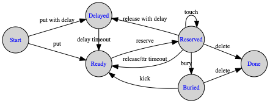
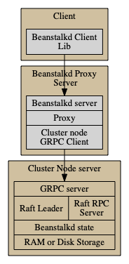

- [Coolbeans High Level Design](#coolbeans-high-level-design)
    - [Consensus](#consensus)
    - [Beanstalkd Job life-cycle](#beanstalkd-job-lifecycle)
    - [Node Design](#node-design)
    - [Setup options](#setup-options)

Coolbeans High Level Design
===========================

This document summarizes design notes for coolbeans. 

To summarize, Coolbeans is a distributed work queue that implements the [beanstalkd protocol](https://github.com/beanstalkd/beanstalkd/blob/master/doc/protocol.txt). 

Coolbeans primarily differs from beanstalkd in that it allows the work queue to be replicated across multiple machines. Coolbeans, uses the [Raft consensus algorithm](https://raft.github.io/) to consistently replicate the job state transitions across multiple machines.  

Consensus
---------

Concept: A state machine consists of a collection of states, a collection of transitions between states, and a current state. A transition to a new current state happens in response to an issued operation and produces an output. In a deterministic state machine, for any state and operation, the transition enabled by the operation is unique and the output is a function only of the state and the operation. 

In essence, a replicated state machine is realized as follows: A collection of replicas of a deterministic state machine are created. The replicas are then provided with the same sequence of operations, so they go through the same sequence of state transitions and end up in the same state and produce the same sequence of outputs. Consensus is the process of agreeing on one result among a group of participants. Specifically, these participants agree on the transitions to made on the replicated state machine. The paper [Paxos made moderately complex](http://www.cs.cornell.edu/courses/cs7412/2011sp/paxos.pdf) provides an in-depth discussion to the distributed consensus problem. 

Raft provides a consensus protocol for state machine replication in a distributed asynchronous environment.

Beanstalkd Job lifecycle
------------------------

The diagram  shows the life-cycle of a beanstalkd job, the different states & transitions. 

Source: This diagram is copied & modified from the [beanstalkd protocol](https://github.com/beanstalkd/beanstalkd/blob/master/doc/protocol.txt). The document is extensive and explains the life-cycle in detail.

In essence, this is the state machine that we are going to replicate across the nodes. Code reference is interface JSM [here](../state/state.go).

Node Design
-----------

This diagram shows the high level processes, its functionality and interactions

There are two primary processes managed by coolbeans, the beanstalkd-proxy and the cluster-node server.

| Process                   | Description  |
|---------------------------|--------------|
| Client                    | A client of the beanstalkd service, the client interacts with the beanstalkd proxy server over TCP using the beanstalkd protocol.  |
| Beanstalkd Proxy Server | Represents the coolbeans beanstalkd proxy server, which interacts with the client via TCP using the beanstalkd protocol. The beanstalkd server is a client to the cluster node server, decoding the beanstalkd requests into GRPC requests to the cluster node server. |
| Cluster Node Server       | The cluster node server maintains the job state. The node is essentially a part of a Raft cluster, where job state transitions are replicated consistently using the Raft consensus protocol. |

The rationale for separating the proxy and the cluster-node include:

- By having two processes, we can natively secure & authenticate the GRPC connection between the proxy-server and the cluster-node server. 
- The cluster node server can be scaled independently of the beanstalkd-proxy. 

Notes: 

- [RQlite](https://github.com/rqlite/rqlite/blob/master/DOC/DESIGN.md) is a good reference on how to design a replicated system using Raft.

Setup options
-------------
- It it recommended to have at least a cluster-nodes in your RAFT cluster to be resilient to the single node failures. 

- Options for setting up beanstalkd-proxy:
    - A single beanstalkd proxy server as a side-car for every machine, or pod, similar to [this](https://cloud.google.com/sql/docs/mysql/sql-proxy). 
    - Have a fleet of one ore more beanstalkd-proxy servers with the cluster-nodes configured as upstreams.

